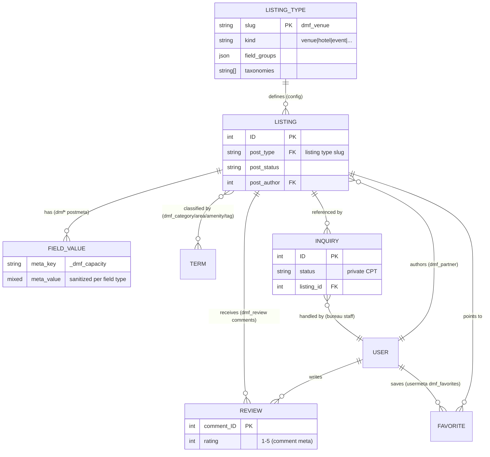

# DMF — Data model & ER diagram

DMF deliberately uses **native WordPress storage** — no custom tables in
v0.x. This buys free compatibility with every backup, migration, cache,
search and multilingual tool. A geo/search index table is planned as an
opt-in Performance add-on for >10k-listing deployments (see ROADMAP).

## Storage map

| Data | Where | Key(s) |
|---|---|---|
| Listings | `wp_posts` | one CPT per listing type (`dmf_venue`, `dmf_hotel`, …) |
| Listing fields | `wp_postmeta` | `_dmf_{field_key}` (typed + sanitized) |
| Geo | `wp_postmeta` | `_dmf_geo` = `{lat, lng}` |
| Ratings (denormalized) | `wp_postmeta` | `_dmf_rating`, `_dmf_rating_count` |
| Categories/areas/amenities/tags | `wp_terms` + `wp_term_taxonomy` | `dmf_category`, `dmf_area`, `dmf_amenity`, `dmf_tag` |
| Reviews | `wp_comments` | `comment_type = dmf_review` + `dmf_rating` comment meta |
| Inquiries (RFP pipeline) | `wp_posts` | private CPT `dmf_inquiry` + `_dmf_inq_*` meta |
| Favorites | `wp_usermeta` | `dmf_favorites` (int[]) |
| Member org profile | `wp_usermeta` | `dmf_organization`, `dmf_org_role` |
| Site-created listing types | `wp_options` | `dmf_listing_types` |
| Settings | `wp_options` | `dmf_settings` (single autoloaded array) |

## ER diagram

## Query hot paths

- Cards read: title + thumbnail + 2–3 metas (`dmf_get_card_fields()`),
  averages pre-denormalized — no COUNT queries at render time.
- Search: one `WP_Query` with tax/meta clauses; radius applied post-query
  (haversine) at destination scale; `no_found_rows` unless paginated.
- GeoJSON: single meta-keyed query, cacheable, 500-feature cap per call.
